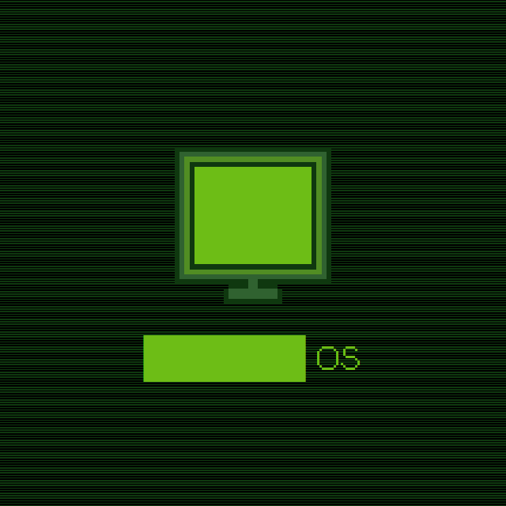

# ██████ OS

This is a little project from me and a group of other people that we're making as a way to tease future things happening in a specific community! It has a lot of ARG-ish elements, but I wouldn't consider it a full ARG in of itself. It's *close*, but not quite there.

I can't say much about this as to not spoil much, so you'll have to explore everything on your own. A lot of you may not have the context to everything though, as a lot of stuff is intentionally left vague, so keep that in mind!

## FEATURES

- A fully functional file system! (Will not add the ability to save stuff because it doesn't fit the vibe, but it could definitely be added at any time)
- A notes app to think about what in the world Warren's is doing here!
- ~~A notifications bar that never gets any notifications!~~ Wait, what do you mean the notifications button isn't there?
- A bottom bar with the time and a chat icon!
- A unique pixel art hacker style!

## CREDITS

**Made for the [Flavortown WebOS Jam](https://flavortown.hackclub.com/sidequests/webos)**

### Character Files
**Shifty, Mystery Man, Jen** ―― Eshan Does (me)

**Juniper** ―― Strawberry Snapdragon

**Syntrex** ―― insurgingarc

**Omega, Omex** ―― Brojogon

**Vixie** ―― CDE/Cassidy

**All the Graces** ―― Skye/April

**Entropy** ―― EdibleEntropy

**Ravenpaw** ―― Suggested by Ryuga, from the Warrior Cats series

### Feedback and Writing Help
**Ryuga** ―― Moderator, wrote Ravenpaw character note and Warrior Cats trivia

**Skye/April** ―― Moderator, wrote the Grace character notes

**Snapdragon** ―― Owner of the Technical Difficulties Discord server, gave the idea for character files and for Silksong trivia

# 

Made by Eshan Does